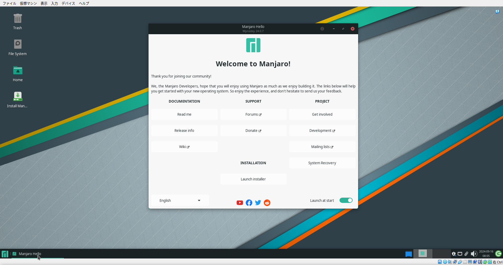
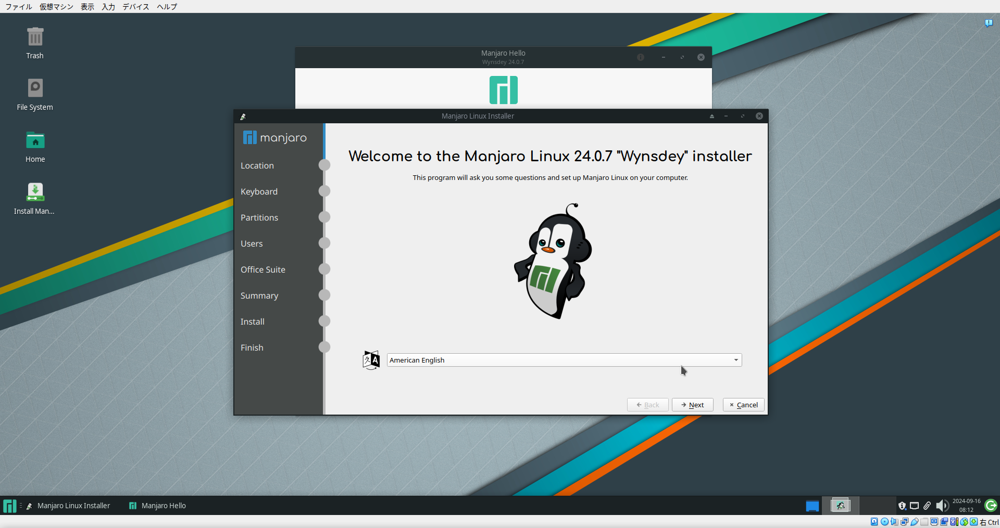

## まとめ

- やる (やった) ことが多すぎてまとめられない。手順の項を読むこと

## この記事の目的・方針

- See: [purpose-and-policy］`installed` シリーズの目的・方針（v2024-09](ed0f0a63-51e1-43b0-8cd6-3bb77de060fb.md)

## 経緯

- 今使っている Manjaro の仮想マシンが、ストレージ容量不足で何もできなくなった
    - 文字通り何もできないわけではないが、少し大きめのパッケージ (Node.js 本体など) がインストールできない
    - ストレージ容量の設定を確認したところ「仮想的なサイズが 8 GB」だった
        - どう見ても少ない
        - たぶん仮想マシン作成時に適当に決めた
- なので仮想マシンを作り直したい
    - 追加のストレージを付けて云々みたいなことも可能だと思うが、その作業自体が難しそうだし、後々変なトラブル呼びそうなので辞めた
        - クリーンインストールするいい機会だったしね
- 各種ツールのインストールは面倒だが、最近ちょうど `myenv` を作り直している途中だからいい練習にもなるのでは

## やりたかったこと

- Manjaro をインストールする
- その後、無事動作することを確認する

## 手順（やったこと）

### 1. Manjaro の ISO をダウンロードした

- [Download Manjaro - Manjaro](https://wiki.manjaro.org/index.php/Download_Manjaro)
- [Download x86 – Manjaro](https://manjaro.org/products/download/x86)
- デスクトップ環境には Xfce を選んだ
- サイズはおよそ 3.6 GB
- ダウンロードに時間はかからなかった

### 2. 仮想マシンの作成をした

#### 1. 新規マシンの作成 (初期設定)

1. 上部のメニューの `仮想マシン` から `新規` を選択する
2. 最初のウィザードページ「仮想マシンの名前と OS」の設定を入力する
    - 注：今回は「エキスパートモード」にせず「ガイド付きモード」で作業を行った
    - `名前`：`soba - Manjaro 24.0 (Xfce Edition)`
        - これたぶん**ローカルで一意な名前にしないとダメ**なやつ
        - そば食べたい
    - `フォルダー`：`~/VirtualBox VMs`
        - これがデフォルト値だったかどうか覚えてない。自分で設定した独自のディレクトリかも
    - `ISO イメージ`：`<先程ダウンロードしたISOファイルのパス>`
    - `タイプ`：`Linux`
        - この選択項目の影響、VirtualBox 内の仮想マシンのアイコンが変わるだけでは？
    - `バージョン`：`Arch Linux (64bit)`
        - Manjaro は arch-based な Linux だからこれでいいんじゃね、たぶん
3. 次のウィザードページ「ハードウェア」の設定を入力する
    - `メインメモリー`：`8192 MB`
        - ホスト OS のスペックを考慮しつつ、適当に決めた。余裕を持たせたかったので少し多めにした
        - ここは仮想マシン作成後も気軽に変更可能なので、割と適当で良い
    - `プロセッサー数`：`3`
        - ホスト OS のスペックを考慮しつつ、適当に決めた。余裕を持たせたかったので少し多めにした
        - ここは仮想マシン作成後も気軽に変更可能なので、割と適当で良い
4. 次のウィザードページ「仮想ハードディスク」の設定を入力する
    - `仮想ハードディスクを作成する` を選択する
        - `ディスクサイズ`：`32.00 GB`
            - 前回作成時に軽い気持ちで `8 GB` にしたせいで後々困ったやつ。今回仮想マシン作り直すことになった直接の原因
            - 本当は `64 GB` くらいにしたかったが、ホストマシンのディスクの空きにあまり余裕がないので今回はこれで我慢
            - 今のマシンに SSD 増設したいな。SATA に余裕あったけ…
5. 次のウィザードページ「概要」の内容を確認する
    - ここまでで設定した内容の要約が表示される
    - 内容を確認し、`完了` を選択する

- ここまでで仮想マシンが作成された
    - VirtualBox のトップページ (？) の仮想マシン一覧に、先ほど作成したマシンが追加されているはずである

#### 2. 仮想マシンへの追加設定

- 仮想マシンに追加の設定を行う
    - 先程の仮想マシン作成時には弄れなかった設定を弄る
- ここの設定はいつでも変えれるので気軽に

1. まず先程の仮想マシンを選択し、右クリックメニューから `設定` を選択し、設定画面を開く
2. 以下の項目を変更する
    - `一般` 項目：
        - `基本` タブ：
            - `名前`：(新規マシン作成時に設定したやつ。今は変更しないでOK)
        - `高度` タブ：
            - `クリップボードの共有`：`双方向`
            - `ドラッグ＆ドロップ`：`双方向`
    - `システム` 項目：
        - `マザーボード` タブ：
            - `メインメモリー`：(新規マシン作成時に設定したやつ。今は変更しないでOK)
            - `起動順序`：`ハードディスク => 光学`
                - デフォルト：`フロッピー => 光学 => ハードディスク`
                - 別にデフォルトのままでも良さそうだが、変えてみた
                    - パフォーマンスが多少向上するかも
            - `チップセット`：`PIIX3` (デフォルトのまま)
                - `ICH9` に変更しようか迷ったが、結局辞めた
                    - 公式ドキュメントに下記の記述があったから
                    - > Chipset (Can't be changed on VMs with an Arm architecture): You can select which chipset will be presented to the virtual machine. PIIX3 is the default chipset for most guests. For some guest OSes such as Mac OS X, the PIIX3 chipset is not well supported. As a result, Oracle VirtualBox supports an emulation of the ICH9 chipset, which supports PCI express, three PCI buses, PCI-to-PCI bridges and Message Signaled Interrupts (MSI). This enables modern OSes to address more PCI devices and no longer requires IRQ sharing. Using the ICH9 chipset it is also possible to configure up to 36 network cards, compared to a maximum of eight network adapters with PIIX3. **Note that ICH9 support is experimental and not recommended for guest OSes which do not require it.**
                    - Source: [Configuring Virtual Machines #Motherboard-Tab](https://www.virtualbox.org/manual/topics/BasicConcepts.html#settings-motherboard)
                - 正直あまりわからん
                - 以下は要出典：
                    - ICH9 は PIIX3 よりも新しいチップセットモデル
                    - ICH9 を選択することで、仮想マシンのパフォーマンスが向上する可能性がある
                    - PIIX3 と ICH9 のどちらが安定するかは OS (状況) によるので、何とも言えない
                    - OS インストール後にチップセットを変更すると、仮想マシンが起動しなくなる可能性がある
        - `プロセッサー` タブ：
            - `プロセッサー数`：(新規マシン作成時に設定したやつ。今は変更しないでOK)
    - `ディスプレイ` 項目：
        - `スクリーン` タブ：
            - `ビデオメモリー`：`128 MB`
                - 設定できる最大にする
                - この設定をしないと、確かめっちゃもっさりした挙動になったはず
                - VirtualBox 使う人、皆必ずと言っていい程こうしてるよね
            - `ディスプレイ数`：`1`
                - `2` でも良かったかも。まあとりあえずこれで
            - `拡張機能：3D アクセラレーションを有効化`：`<OFF>` (デフォルトのまま)
                - 弄ろうか迷ったが、結局弄ってない
                - 環境によっては on/off にした方が安定したりパフォーマンス上がったりするっぽい (要出典)
                - ここよくわからん
    - `ストレージ` 項目：
        - 特に何もしない
        - TODO:今回は特に弄らなかったが、弄ったほうが良い？あまりわからん
    - `オーディオ` 項目：
        - 特に何もしない
    - `ネットワーク` 項目：
        - 特に何もしない
        - TODO:今回は特に弄らなかったが、色々弄りたい
    - `シリアルポート` 項目：
        - 特に何もしない
    - `USB` 項目：
        - 特に何もしない
    - `共有フォルダー` 項目：
        - 特に何もしない
            - そのうち (共有フォルダーが必要になったら) 弄るかも
    - `ユーザーインターフェース` 項目：
        - 特に何もしない

### 3. インストール作業をした

- ここからは Manjaro のインストーラーの指示に従って作業をする
    - Manjaro のインストーラーは結構いい感じで、文字通り「指示に沿って作業をする」だけ
        - 流石、初心者向けでお勧めされる [^1] だけある

1. 仮想マシンを選択し、右クリックメニューから 起動 (通常起動) をする
2. 少し待つ (20 秒くらい)
3. Manjaro (ライブ環境) が起動し、`Manjaro Hello` アプリが表示されるので、`Launch installer` を選択してインストーラーを起動する
    
4. 以降はインストーラーの指示に従う
    1. トップページ：
        - 言語：`American English`
            - これは多分、インストーラーの表示言語
        - 
    2. `Location` ページ：
        - (弄ってない)
        - `Region`：`Asia`
        - `Zone`：`Tokyo`
        - `The system language`：`en_US.UTF-8`
            - 日本語と迷ったが、メニュー周りが日本語だと検索しづらいので英語にした
            - Manjaro は後から日本語入力の設定するのも簡単らしいしね
        - `The numbers and dates locale`：`ja_JP.UTF-8`
    3. `Keyboard` ページ：
        - (弄ってない)
        - `Keyboard Model`：`Generic 105-key PC`, `English (US)`, `Default`
    4. `Partitions` ページ：
        - (弄ってない)
        - `Erase disk or MAnual partitioning`：`Erase disk`
    5. `Users` ページ：
        - `<ユーザー名>`：任意
        - `<パスワード>`：任意
        - `<ホスト名>`：`soba` (任意)
        - `Log in automatically without asking for the password.`：`<on>`
            - 自動ログインの設定。ここは好みでOK
        - `Use the same password for the administrator account.`：`<on>`
            - 管理者垢パスワードもユーザー垢パスワードと同じにするかどうか
    6. `Office Suite` ページ：
        - `Choose office suite`：`No Office Suite`
    7. `Summary` ページ：
        - 確認画面。確認して次へ
    8. `Install` ページ：
        - インストールが進むのでしばらく待つ (5-10 分くらい)
    9. `Finish` ページ：
        - `Restart now` にチェックを入れて `Done` を選択

### 4. バージョンを確認した

動作確認。

```sh
$ /bin/bash -c "$(curl -fsSL https://raw.githubusercontent.com/rnazmo/proper7y/v0.4.2/proper7y)"
proper7y v0.4.2 - A tiny Bash script to get OS and other
software version info. https://github.com/rnazmo/proper7y
============================================================
OS NAME      : Manjaro Linux
OS VERSION   : 24.0.7
Current Shell: Bash
Bash VERSION : 5.2.32(1)-release (x86_64-pc-linux-gnu)
Zsh VERSION  : 5.9 (x86_64-pc-linux-gnu)
CPU ARCH     : x86_64
============================================================
```

ここまでが本当に最低限のインストール作業。

### 5. Guest Additions をインストールしようとした（が不要だった）

- まとめ：
    - 特に何もしてない
- ゲスト OS に Guest Additions をインストールしようとしたが、既に勝手にインストールされてるっぽい？
    - 判別方法：ホスト側の仮想マシンのウィンドウサイズを拡大縮小すると、ゲスト側も全体がなんか良い感じに拡大縮小される
        - これは Guest Additions の機能のはず
- なんか Guest Additions のインストールは不要みたいな話もあるっぽいがよくわからん
- とりあえず、Guest Additions のインストールは不要そうなので、何もしなかった

### 6. ミラーサーバーの変更をした

```sh
sudo pacman-mirrors --fasttrack
```

少し時間がかかる (3-4 分くらい)

### 7. システム（パッケージ）の更新

```sh
sudo pacman -Syy
```

### 8. 日本語入力の設定をした

1. fcitx-mozc のインストール
    1. スタートメニューから `Manjaro Hello` アプリを再度起動する
    2. 真ん中の下あたりにある `Applications` を選択する
    3. `Extended language support` > `Manjaro Asian Input Support Fcitx` にチェックを入れ、右上の `UPDATE SYSTEM` を選択する
    4. `Choose optional depdendencies for manjaro-asian-input-support-fcitx` というウィンドウが出てくるので、`fcitx-mozc: 日本語 | Japanese` にチェックを入れ、次へ
    5. 確認画面が出てくるので、`Apply` を選択して次へ進む
    6. 少し待つ
    7. おわり
2. 言語パッケージ (？) の追加インストール
    1. スタートメニューから `Manjaro Setting Manager` アプリを起動する
    2. `Language Packages` を選択する
    3. 右上の `Install Packages` を選択する
3. マシンを再起動する
4. 英語・日本語の入力切り替えにショートカットを割り当てる (注：私の今のキーボードには**半角・全角キーが無い**)：
    1. スタートメニューから、`Fcitx Configuration` アプリを起動する
    2. 最初の画面 (＝ `Input Method` タブ) の左下の `+` を選択する
    3. `Add input method` ウィンドウが開くので、**`Only Show Current Languages` のチェックを外し**、`Mozc` を探して選択する
        - Input Method の順序は特に弄らないで良い (`Keyboard-English (US)` => `Mozc`)
    4. Optional：`Global Config` タブを開き、`Trigger Input Mehtod` の `Ctrl+Space` を `Alt+\`` (など) に**上書き**する
        - NOTE: **`Ctrl+Space` は VS Code の「サジェストのトグル」みたいなショートカットキーと被って**て、後々困るので変更した
            - 今までは `Ctrl+Space` でやっていたが、丁度良い機会ということで変えた
            - 私の今のキーマップ的に Alt は誤動作しやすく、かなり使いづらいけどどうしようこれ…
5. スタートメニューから、**メモ帳アプリ `Mousepad`** を起動して、日本語入力ができることを試す
    - ここまででで、日本語入力ができるようになっているはずである
    - 切り替えのショートカットキーは、先程変更した通り**`Alt+\``** である
6. おわり

- 日本語入力周りの設定、全然よくわからん。
- TODO: fcitx から fcitx5 に乗り換えた方が良さそう

### 09. 日本語フォントをインストールした

```sh
sudo pacman -S noto-fonts-cjk
```

- システムのフォントを (日本語対応フォントに) 変更する必要ある？
    - システムの言語を英語で使ってるから、無い
    - システムの言語を日本語で使いたいなら、必要かも
- だが、それはそれとして noto-fonts-cjk はインストールしておいた

### 10. 時刻同期とタイムゾーンの設定をした

1. スタートメニューから `Manjaro Setting Manager` アプリを起動する
2. `Time and Date` を選択する
3. `Set time and date automatically` にチェックが入っていることを確認する
4. `Time zone` が `Asia/Tokyo` であることを確認する
5. おわり

### 11. ロケールの設定を確認した（がよくわからないのでスルーした）

もうだいぶ疲れてきて、かなり適当になっている。

1. スタートメニューから `Manjaro Setting Manager` アプリを起動する
2. `Locale Settings` を選択する
3. よくわからないが、何となく大丈夫そうなことを確認する
4. おわり

### 12. ファイアウォールの設定をした

1. スタートメニューから、ファイアウォールアプリ `Gufw` 起動する
2. `Status` を on にトグルする
3. おわり

注：細かい設定についてはここでは触れない

### 13. デスクトップ下段のパネルを上段に移動した

- パネル ＝ Windows で言うタスクバー

1. パネル上で右クリックし、`Panel Preferences` を選択し、`Panel Preferences` ウィンドウを出す
2. `Lock panel` のチェックを外す
3. パネルの左右の端をマウスで掴んで上端まで移動させる
4. `Lock panel` のチェックを付け直す
5. おわり

### 14. Thunar で隠しファイルを表示するように設定した

1. スタートメニューから、ファイルマネージャーアプリ `Thunar` 起動する
2. 上部のメニューの `View` を選択する
3. `Show Hiden Files` にチェックを入れる
4. おわり

### 15. 仮想マシンのスナップショットを作成した

1. 一度、仮想マシンをオフにする
2. メニューから `スナップショット` > `作成` を選択する
3. 名前と説明を適当に入力して、作成する

以上で大体おわり。

### 16. この後やるべきことのメモ

- git の初期設定
    - global config
    - GitHub への SSH 接続設定
- yay のインストール
    - `sudo pacman -S yay`
- base-devel のインストール
    - `sudo pacman -S base-devel`
- dotfiles の適用
- 再度スナップショットを作成
- など

## 環境

### ゲスト (= VirtualBox の仮想マシン)

```sh
$ ~/bin/proper7y 
proper7y v0.4.2 - A tiny Bash script to get OS and other
software version info. https://github.com/rnazmo/proper7y
============================================================
OS NAME      : Manjaro Linux
OS VERSION   : 24.0.8
Current Shell: Bash
Bash VERSION : 5.2.32(1)-release (x86_64-pc-linux-gnu)
Zsh VERSION  : 5.9 (x86_64-pc-linux-gnu)
CPU ARCH     : x86_64
============================================================

$ vboxmanage --version
7.0.20r163906
```

### ホスト

```sh
$ ~/bin/proper7y 
proper7y v0.4.2 - A tiny Bash script to get OS and other
software version info. https://github.com/rnazmo/proper7y
============================================================
OS NAME      : Manjaro Linux
OS VERSION   : 24.0.8
Current Shell: Bash
Bash VERSION : GNU bash, バージョン 5.2.32(1)-release (x86_64-pc-linux-gnu)
Zsh VERSION  : 5.9 (x86_64-pc-linux-gnu)
CPU ARCH     : x86_64
============================================================

$ vboxmanage --version
7.0.20r163906
```

## 感想

- 疲れて途中で集中切れた
- この記事書くの面倒だったが、これで次からは (これを見ながら作業すれば良いので) 楽になる。はず
- **出来上がった仮想マシンはかなり良い感じ**
- i3wm も試したいから仮想マシン作って触ってみたい
- Endeavour OS も同上
- 余談だけど、クリックっぽい動作は全部「選択する」に統一した (表記揺れ対策)
    - not：選ぶ、クリックする、押下する、選択する

## 脚注

[^1]: 要出典

## 参考

- 「VirtualBox に Manjaro をインストールする手順」全体：
    - [Running a Linux Manjaro VM in Virtualbox](https://i12bretro.github.io/tutorials/0142.html)
    - **[Install Manjaro23.1.0 (Linux) on VirtualBox7 - Japanese input - YouTube](https://www.youtube.com/watch?v=0LPGd5rHJCU)**
    - [Install Manjaro23.0 on VirtualBox7 - Japanese input - YouTube](https://www.youtube.com/watch?v=18Kd8xG_W1Q)
- Manjaro ISO のダウンロードリンク：
    - [Download Manjaro - Manjaro](https://wiki.manjaro.org/index.php/Download_Manjaro)
    - [Download x86 – Manjaro](https://manjaro.org/products/download/x86)
- VirtualBox の仮想マシンの作成：
    - [First Steps #Adding-Virtual-Machines](https://www.virtualbox.org/manual/topics/Introduction.html#add_vm)
- 設定弄る系：
    - [VirtualBox速度チューニングや仮想化関連のGUI設定手引き | DEVLABO](https://dev-labo.com/wordpress/virtualization-tuning-settings/)
    - [VirtualBox 最大パフォーマンスでUbuntu環境を構築する - ほりべあぶろぐ](https://holybea.com/2015/07/08/virtualbox-ubuntu/)
    - [First Steps](https://www.virtualbox.org/manual/topics/Introduction.html#create-vm-wizard-unattended-install)
    - [Configuring Virtual Machines](https://www.virtualbox.org/manual/topics/BasicConcepts.html#BasicConcepts)
- 「インストール直後にすること」全体：
    - [Manjaro Linux 最初の一歩 #インストール後に最初にしておくとよいこと。 - Qiita](https://qiita.com/phoepsilonix/items/b287aacf2de0ee89681b#%E3%82%A4%E3%83%B3%E3%82%B9%E3%83%88%E3%83%BC%E3%83%AB%E5%BE%8C%E3%81%AB%E6%9C%80%E5%88%9D%E3%81%AB%E3%81%97%E3%81%A6%E3%81%8A%E3%81%8F%E3%81%A8%E3%82%88%E3%81%84%E3%81%93%E3%81%A8)
    - [Manjaro Linuxでしあわせ環境を構築する](https://zenn.dev/calloc134/articles/0a9eae7c8df0d3#%E5%9F%BA%E6%9C%AC%E7%9A%84%E3%81%AA%E3%82%A4%E3%83%B3%E3%82%B9%E3%83%88%E3%83%BC%E3%83%AB)
    - [Manjaro Linux (Xfce Desktop) インストール手順 – ロハスな生き方に憧れて！　温泉、Open Source、･･･](https://fanofdido.blog/manjaro-linux-xfce-desktop/)
    - [（備忘録）Manjaro Linux 初期設定手順 - Qiita](https://qiita.com/zono_0/items/dc09a77ca70a6d52d3a8)
    - [Manjaro Linux (Gnome Desktop) インストール手順 – ロハスな生き方に憧れて！　温泉、Open Source、･･･](https://fanofdido.blog/manjaro-linux-gnome-install/)
    - [manjaro linux インストール後にする事 - Qiita](https://qiita.com/kxkx5150/items/16b2d5ee6cdea916ef44)
    - [Manjaro Linux Xfceインストール後の基本設定 | プログラミングって大変だ](https://kotetsu1701.com/note/basic-settings-after-installing-manjarolinux-xfce/)
    - [Manjaro インストール直後にやること12選 - In my mind](https://in-my-mind.hatenablog.jp/entry/12things-to-do-after-installing-manjaro-2020-04-18)
- ミラーサーバーの変更：
    - [Manjaro Linux のアップデートが遅いのでミラーサーバーを変更した - turtlechanのブログ](https://turtlechan.hatenablog.com/entry/2019/08/25/194849)
    - [ミラー - ArchWiki](https://wiki.archlinux.jp/index.php/%E3%83%9F%E3%83%A9%E3%83%BC)
- 日本語入力の設定：
    - [朗報！ついに Manjaro Linux で 日本語入力を簡単に導入 できるようになった！！](https://gae-fan.blogspot.com/2020/06/manjaro-linux.html)

## 関連リンク

- [Oracle VirtualBox: User Guide for Release 7.1](https://www.virtualbox.org/manual/)
- [朗報！ついに Manjaro Linux で 日本語入力を簡単に導入 できるようになった！！](https://gae-fan.blogspot.com/2020/06/manjaro-linux.html)
- [インストールガイド - ArchWiki](https://wiki.archlinux.jp/index.php/%E3%82%A4%E3%83%B3%E3%82%B9%E3%83%88%E3%83%BC%E3%83%AB%E3%82%AC%E3%82%A4%E3%83%89)
- [VirtualBox/Arch Linux をゲストにする - ArchWiki](https://wiki.archlinux.jp/index.php/VirtualBox/Arch_Linux_%E3%82%92%E3%82%B2%E3%82%B9%E3%83%88%E3%81%AB%E3%81%99%E3%82%8B)

## TODO

- [ ] 今のマシン (物理) に SSD 増設したい
    - 注：この記事でやることでは全く無い
- [ ] VirtualBox の仮想マシンのネットワーク周り弄りたい
    - Ref:
        - [VirtualBoxのネットワーク設定を絵で説明する #Network - Qiita](https://qiita.com/feifo/items/0fde474005589afcff68)
        - 書籍「ハッキング・ラボのつくりかた」
- [ ] Guest Additions が不要だった (既に自動でインストールされていた？) のはなぜ？
- [ ] 日本語入力は fcitx から fcitx5 に乗り換えた方が良さそう
    - これは別記事 (Scrap) かな
    - Ref:
        - [Arch Linuxの日本語入力をfcitxからfcitx5に切り替える | クロの思考ノート](https://note.kurodigi.com/archlinux-fcitx5/)
        - [Fcitx - ArchWiki](https://wiki.archlinux.jp/index.php/Fcitx)
        - [Fcitx5 - ArchWiki](https://wiki.archlinux.jp/index.php/Fcitx5)
- [ ] SSD Trim?
    - via: [Manjaro Linux (Xfce Desktop) インストール手順 – ロハスな生き方に憧れて！　温泉、Open Source、･･･](https://fanofdido.blog/manjaro-linux-xfce-desktop/#ssd-trim)
- [ ] 「インストール作業のチェックリスト」とか作っても良さそう？
    - Ref: [Running a Linux Manjaro VM in Virtualbox](https://i12bretro.github.io/tutorials/0142.html)
