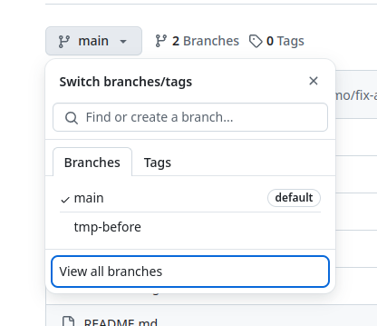
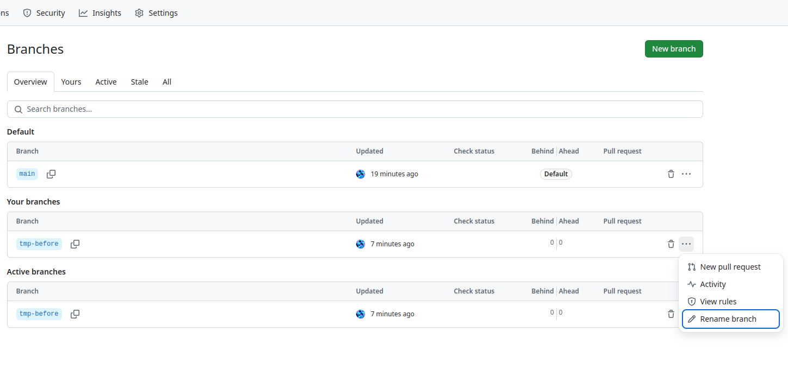
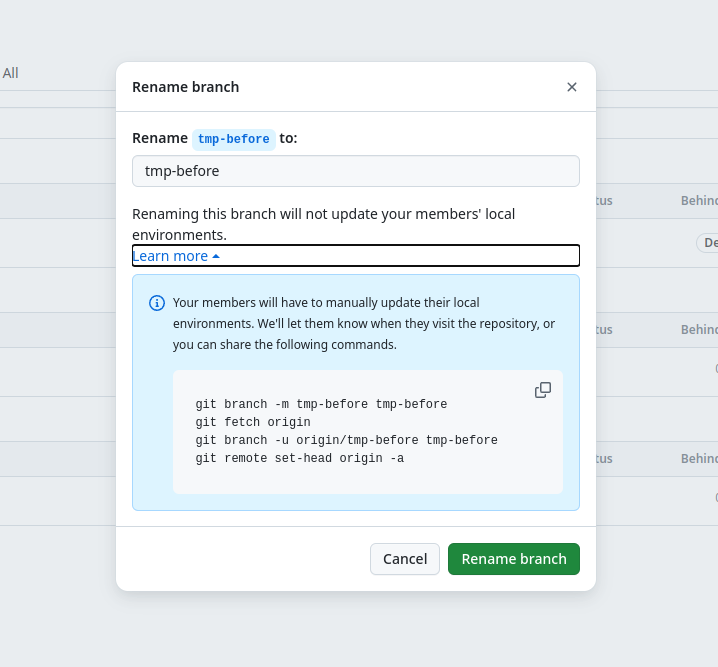

## まとめ

- ブラウザから GitHub 上で簡単にリネームできる
- 手順：
  1. 左上のブランチのドロップダウンメニューから`View all branches` を選択し、`Branches` ページへ飛ぶ
  2. 該当ブランチの右端にある…ドロップダウンメニューから `Rename branch` を選択する
  3. 変更用のウィンドウで新しい名前を入力する

## やりたかったこと

- GitHub 上でブランチをリネームしたい

## 手順（やったこと）

1. リポジトリのメインページの左上にあるブランチのドロップダウンメニューから `View all branches` を選択し、`Branches` ページへ飛ぶ
  
2. 該当ブランチの右端にある…ドロップダウンメニューから `Rename branch` を選択
  
3. 変更用のウィンドウが表示されるので、新しい名前を入力すればOK
  

## 感想

- GUI でポチポチするだけでできる
- GitHub 上でできて楽

## 参考

- [ブランチの名前を変更する - GitHub Docs](https://docs.github.com/ja/repositories/configuring-branches-and-merges-in-your-repository/managing-branches-in-your-repository/renaming-a-branch)
